# Performance Report

This report summarizes the performance of the CO2 Data app, measured using **React DevTools Profiler**. Key interactions were analyzed to understand render behavior and component efficiency.

---

## Interactions Checked

- **sorting a column**
- **searching a country**
- **selecting another year**
- **opening modal window and adding columns**

---

## 1. Sorting a Column:

### before:

- **Commit Duration**: 3.2s
- **Render Duration**: 157.1ms
- **Flame Graph**:
  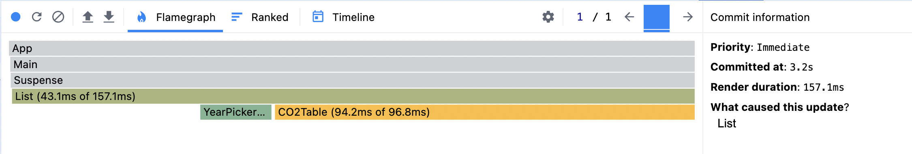
- **Ranked Chart**:
  

### after:

- **Commit Duration**: 2.3s
- **Render Duration**: 150.5ms
- **Flame Graph**:
  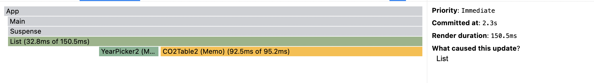
- **Ranked Chart**:
  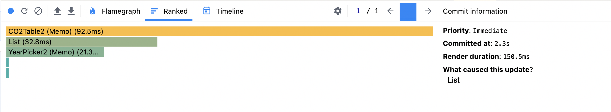

---

## 2. Searching a Country:

### before:

- **Commit Duration**: 1.8s
- **Render Duration**: 47.6ms
- **Flame Graph**:
  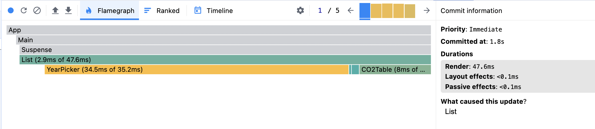
- **Ranked Chart**:
  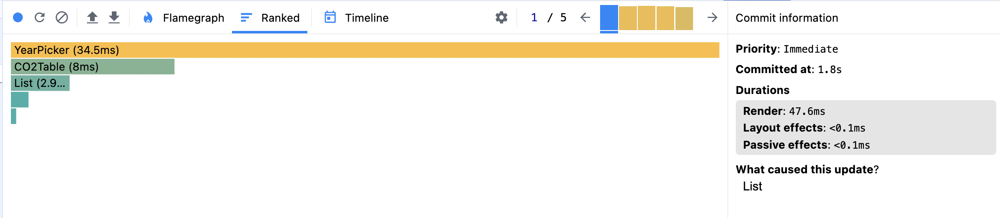

### after:

- **Commit Duration**: 1.4s
- **Render Duration**: 34ms
- **Flame Graph**:
  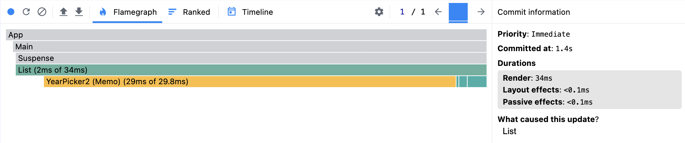
- **Ranked Chart**:
  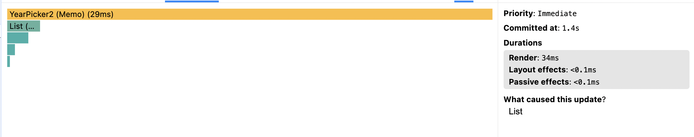

---

## 3. Selecting another Year:

### before:

- **Commit Duration**: 2.3s
- **Render Duration**: 130ms
- **Flame Graph**:
  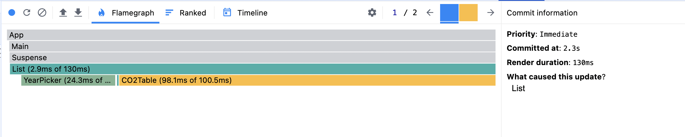
- **Ranked Chart**:
  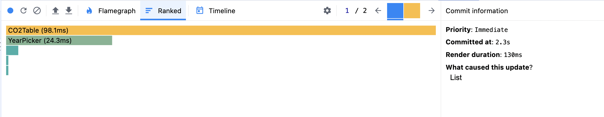

### after:

- **Commit Duration**: 2s
- **Render Duration**: 39.5ms
- **Flame Graph**:
  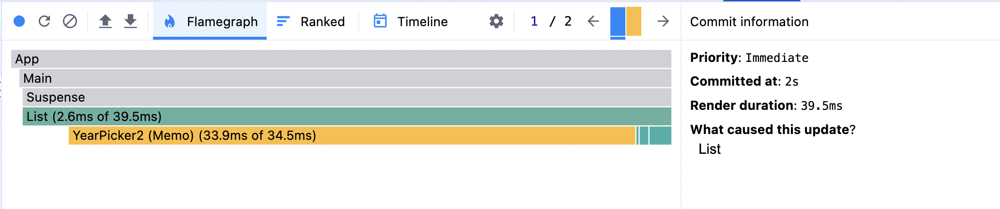
- **Ranked Chart**:
  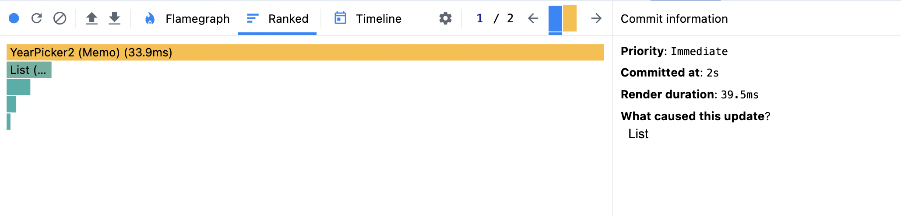

---

## 4. Opening modal window and adding columns:

### before:

- **Commit Duration**: 0.9s
- **Render Duration**: 148.4ms
- **Flame Graph**:
  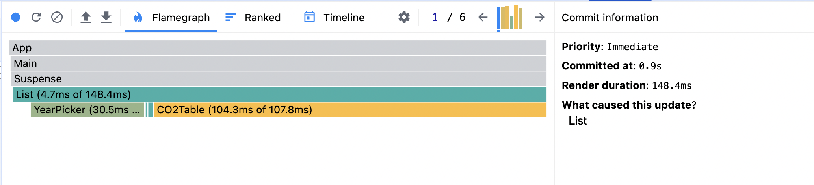
- **Ranked Chart**:
  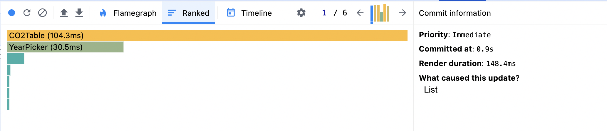

### after:

- **Commit Duration**: 0.8s
- **Render Duration**: 141.4ms
- **Flame Graph**:
  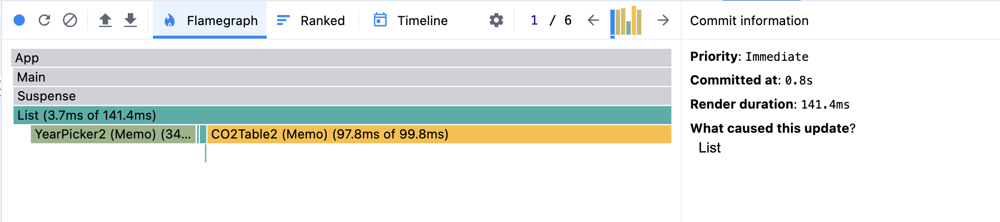
- **Ranked Chart**:
  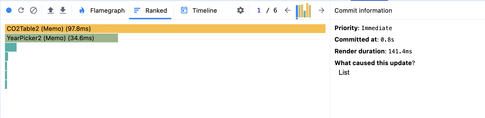

---

The app now renders faster and more efficiently. User interactions like sorting, searching, selecting years, and adding columns trigger smoother updates, with shorter commit and render durations overall.
